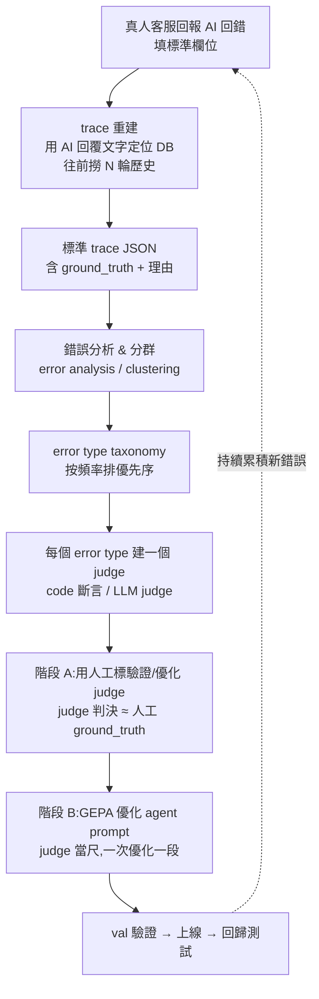

# 醫美客服 Agent — 從錯誤回報到 GEPA 優化的完整流程

> 目的:把「真人客服回報 AI 回錯」這件事,系統化成一條可重複的資料 → 評估 → 優化管線。
> 最終目標:用累積的真實錯誤,自動優化 agent 的 prompt,讓它越用越少犯錯。

---

## 0. 全貌(一張圖看懂)



**三句話總結**
1. **資料**:200 筆真實錯誤 + 人工對錯標(ground_truth)= 一把「尺」。
2. **judge**:每種錯一個 judge;先用人工標把 judge 校準到跟人一致(階段 A)。
3. **GEPA**:用校準好的 judge 當回饋,反覆改寫 prompt 文字去逼近那把尺(階段 B)。

---

## 1. 階段 0 — 資料收集

### 1.1 真人客服回報欄位(回報表單規格)

| 欄位 | 必填 | 說明 | 用途 |
|---|---|---|---|
| `customer_message` | ✅ | 觸發這次錯誤回覆的「客人那一句」 | trace 的 input |
| `ai_reply` | ✅ | **AI 實際回覆的原文,照貼不要改字** | trace 的 output **＋ 定位 DB 的 join key** |
| `fb_account` | ✅ | 客人的 PSID / 對話識別 | 定位 DB、撈歷史 |
| `error_reason` | ✅ | 哪裡錯了(至少一句話) | ground_truth 理由 / GEPA 反思燃料 |
| `ideal_reply` | ⭐建議 | AI **應該**怎麼回 | 階段 B 的最強回饋(實際 vs 應該的落差) |
| `is_multi_turn` | ⭐建議 | 這個錯是否「要看前幾輪才看得出來」(重複追問/重複推薦) | 決定要不要撈歷史 |
| `severity` | 選填 | 嚴重度(高/中/低) | 排優先序 |

> ⚠️ **客服不需要手貼歷史對話。** 只要照貼 `ai_reply` 原文 + `fb_account`,歷史由程式自動補(見 1.2)。
> ⚠️ **不要依賴客服填的時間**(人工填不準),時間只當「撞名時的次要線索」。

### 1.2 trace 重建(自動補歷史,不靠時間)

DB 是「一筆回覆一筆存」,所以每則 AI 回覆 = 一個 row,可用文字比對命中:

1. **命中那一筆**:`WHERE fb_account = X AND 內容 ≈ ai_reply`
   - 先精確比對;差一點用模糊比對(先正規化:去空白 / markdown / emoji / URL 再比)。
2. **往前撈歷史**:用 **DB 自己的排序鍵**(自增 `id` 或 DB 寫入的 `created_at`,可靠)往前抓同一 `fb_account` 的前 N 筆 → 組成 `message_history`。
3. **撞名處理**(同一句回覆對同一客人出現多次):用客服的粗略時間挑最近的,或取最新一筆,真的分不出再人工覆核。

> 💡 **長期最佳解**:在 `execute_backend_agent` 把每筆進來的 `BackendUserQuery`(本身含 `message_history`)+ 回出去的 `BackendResponse` 存成 log。之後客服 flag 哪則,直接用文字比對到 log,**歷史已附著、連往前撈都免**。

### 1.3 標準 trace JSON schema

```json
{
  "id": "case_0001",
  "input": {
    "content": "客人那一句",
    "message_history": [
      { "type": "human", "content": "..." },
      { "type": "ai", "content": "..." }
    ]
  },
  "agent_output": "AI 實際回覆原文",
  "ideal_output": "AI 應該回什麼(選填,階段 B 用)",
  "ground_truth": false,
  "error_reason": "提到肉毒,不在白名單 → 不合規",
  "failure_mode": "白名單幻覺",
  "responsible_prompt": "info_composer_prompt"
}
```

- `ground_truth`:**false = 這則有犯指定的那種錯**。一個維度一個布林,別一張表混七種錯。
- `failure_mode` / `responsible_prompt`:在階段 1 標,讓後面歸責 & 排優先用。

---

## 2. 階段 1 — 錯誤分析 & 分群(Error Analysis / Clustering)

目的:把一堆失敗整理成「有哪些錯誤類型(error type)」,並排出優先序。

### 2.1 兩種來源並用

- **由上而下(已知規則)**:本來就有的 invariant 被違反,直接列成 error type。
- **由下而上(cluster 分群)**:讀 200 筆回報,把「塞不進已知規則」的相似失敗歸堆,挖出沒預想到的新 error type。
  - 量小 → 手動在試算表邊讀邊分堆(最準)。
  - 量大 → 把 `error_reason` 丟 LLM 提議分群,人工覆核。

### 2.2 error type → 負責 prompt 對應表(歸責)

> 架構是你設計的,**每種錯幾乎一對一對到某段 prompt**,初期直接「手動歸責」,比讓優化器自己猜更穩。

| error type(cluster) | 典型徵狀 | 負責 prompt | 抓法 |
|---|---|---|---|
| 白名單幻覺 | 提到診所沒有的療程(肉毒/玻尿酸…) | `info_composer_prompt` | code 子字串黑名單 |
| 價格幻覺 | 自己編價格 / 拆組合價 | `info_composer_prompt` | code regex/數值比對 |
| 跳過推薦直接報價 | 用部位問價時沒先推薦 | `info_composer_prompt` | LLM judge |
| 過度承諾 | 「保證有效」「完全消除」 | `info_composer_prompt` | LLM judge |
| 症狀分類錯 / 該檢索沒檢索 | 沒撈到該有的療程 | `info_planner_prompt` | LLM judge + 檢索檢查 |
| 重複追問(同理沒限一次) | 重問已答過的問題 | `info_composer_prompt` | LLM judge(需歷史) |
| 重複推薦 | 又推一次已介紹的療程 | `info_composer_prompt` | LLM judge(需歷史) |
| 預約欄位/流程錯 | 預約資訊處理錯 | `booking_prompt` | LLM judge |
| 路由錯 | 該進 information 卻進 booking | `supervisor_prompt` | code(節點軌跡)|

### 2.3 排優先序

按 **頻率 ×(嚴重度)** 排序,先攻最高頻的 error type → 先建它的 judge、先優化它對應的 prompt。

---

## 3. 階段 2 — 建 judge(每個 error type 一個)

### 3.1 分工:不是每種錯都該用 LLM judge

| 性質 | 用什麼 | 例子 |
|---|---|---|
| 客觀、可字串/數值判定 | **code 斷言**(便宜、100% 可靠) | 白名單幻覺、價格幻覺、路由錯、CallCS 值 |
| 主觀、語意的 | **LLM judge** | 跳過推薦、過度承諾、重複追問、語氣 |

> 安全關鍵項(白名單)優先用 code 斷言,別交給會模糊判斷的 LLM。

### 3.2 LLM judge 輸出 schema(structured output)

每個 judge 只判一件事,輸出 **判決 + 理由**(理由同時是 GEPA 反思的燃料):

```python
class JudgeVerdict(BaseModel):
    failure_mode: str          # 這個 judge 負責的錯誤類型
    passed: bool               # True = 沒犯這種錯
    justification: str         # 判定理由,引用回覆內容
```

> 跨輪類的 judge(重複追問/重複推薦)記得把 `message_history` 一起餵給 judge,否則判不出來。

---

## 4. 階段 A — 驗證 / 優化 judge(讓 judge ≈ 人)

**前提**:LLM judge 自己也會錯,要先校準到跟人工標一致,才可信。

1. 拿 200 筆的 **人工 `ground_truth`** 當對答案。
2. 跑 judge → 算 judge 判決 vs 人工標的 **一致率 / Cohen's kappa**。
3. 不夠準 → 改 judge prompt → 再驗。

- **手動版**:自己改 judge prompt 幾輪到夠準(簡單情況夠用)。
- **GEPA 版(進階)**:把 judge prompt 當 seed,200 筆當 dataset,GEPA 自動改寫 judge prompt 去逼近人工標。
  - 注意:**不能用 LLM 標的資料驗證 LLM judge**(循環)。黃金標準必須人工把關。

> ✅ 通過標準(建議):一致率 ≥ 90%、且漏抓(false negative)極低。judge 校準好,才進階段 B。

---

## 5. 階段 B — GEPA 優化 agent prompt

### 5.1 三個零件(別混在一起)

| 零件 | 是什麼 | 對應 |
|---|---|---|
| **seed candidate** | 被優化的起始 prompt | agent 現在的某段 prompt(如 `info_composer_prompt`)|
| **dataset(train/val)** | 帶 ground_truth 的 case | 200 筆(切 train/val)|
| **feedback function** | 跑一次、打分 + 給文字理由的尺 | 階段 A 校準好的 judge |

### 5.2 GEPA 迴圈

1. 拿 seed prompt 在一小批 case 上跑 → 產生回覆。
2. judge 打分 + 吐文字理由。
3. 把失敗 trace + 理由餵反思 LLM →「prompt 哪句害它答錯」→ 生出突變 prompt。
4. 新 prompt 在 val 驗證,維護 Pareto front。
5. 反覆,直到預算用完 → 給最佳 prompt。

### 5.3 重要紀律:一次只優化「一段」prompt

- 用 error type → §2.2 對應表找出**負責的那段 prompt**,**只把它當 seed,其他固定不動**。
- 完全繞開多模組 credit assignment 的複雜度,好驗證、好回滾。
- 熟了、也有 per-module trace 後,再進階到「GEPA 同時優化多段」(DSPy 會自動記每個 module 的 I/O)。

### 5.4 工具選擇

| 方式 | seed 怎麼給 | 適合 |
|---|---|---|
| **standalone `gepa`** | 傳 dict:`{"info_composer_prompt": "..."}` + 自訂 feedback fn | 手寫 prompt 現況(較貼)|
| **DSPy `dspy.GEPA`** | 傳進去的 program,內建 signature 即 seed | 願意把模組改寫成 DSPy |

---

## 6. 階段 5 — 上線驗證 & 回歸

- [ ] GEPA 給的「最佳 prompt」必須在**沒拿來訓練的 val**上確認真的變好,才上線。
- [ ] 把這批 case 留成**回歸測試集**,之後每次改 prompt 都重跑,防退化。
- [ ] 上線後持續累積新錯誤回報 → 回到階段 0,管線循環。

---

## 7. 名詞對照表

| 詞 | 意思 |
|---|---|
| trace | 一筆對話紀錄(input + agent 輸出,可含歷史)|
| ground_truth | 人工標的對錯,judge 的「對答案」|
| error type / failure mode | 一種錯法,每種對應一個 judge |
| cluster | 把相似失敗分群,用來「發現」error type |
| judge / feedback function | 打分 + 給理由的尺;GEPA 的回饋來源 |
| seed candidate | GEPA 的起始 prompt(被優化的東西)|
| candidate | 一整套可優化 prompt 的具體寫法 |
| credit assignment | 多 prompt 時,判斷該改哪一段 |
| Pareto front | GEPA 保留的一組各有所長的 prompt |

---

## 8. 落地待辦 Checklist

**資料層**
- [ ] 定版客服回報表單欄位(§1.1)
- [ ] 寫 `reconstruct_trace.py`:文字比對定位 + 往前撈歷史(§1.2)
- [ ](可選)在 `execute_backend_agent` 加 request/response 持久化 log
- [ ] 累積到 ~200 筆標準 trace JSON(§1.3)

**評估層**
- [ ] 對 200 筆做 error analysis + clustering(§2)
- [ ] 標 `failure_mode` + `responsible_prompt`,排頻率優先序
- [ ] 為前 2–3 高頻 error type 各建一個 judge(§3)
- [ ] 階段 A:驗證 judge 一致率 ≥ 90%(§4)

**優化層**
- [ ] 切 train/val
- [ ] 對最高頻 error type,GEPA 優化「對應那一段」prompt(§5)
- [ ] val 驗證 → 上線 → 納入回歸集(§6)

---

> 維護原則:這份文件描述的是「**一次優化一段、按頻率推進**」的循環。先把第一個高頻 error type 完整跑通一輪(回報 → judge → GEPA → 上線),再複製到下一個,不要一開始就想同時優化全部。
