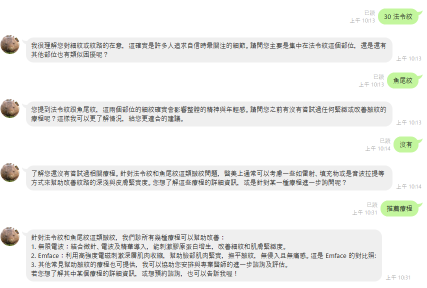
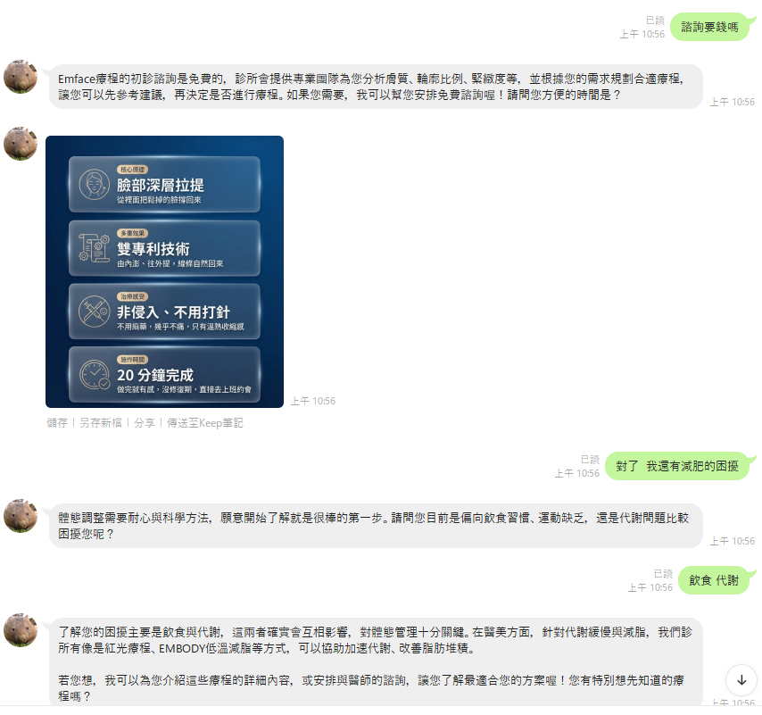
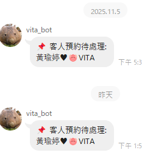

  # Clinics AI Agent

  一個醫美診所專用的 AI 客服系統，結合 **OpenAI / LangChain / LangGraph / LangSmith**，
  以同一套核心 agent 同時支援 **LINE** 與 **Facebook（Messenger）** 兩個通道，可以：
  - 提供症狀諮詢與同理心回覆
  - 推薦本診所療程（嚴格限定療程白名單，避免幻覺）
  - 查詢療程費用、初診資訊與診所基本資料
  - 協助用戶預約並在需要時轉接真人客服

  ---

  ## 功能特色
  - **AI 諮詢助理**：理解使用者症狀與需求，動態追問收集資訊，提供精準療程推薦
  - **多代理協作**：以 LangGraph 編排 Supervisor → Information / Booking → Moderator 流程
  - **防幻覺機制**：療程白名單 + 費用 pre-filter，AI 只能依檢索結果與資料庫費用回覆
  - **圖片處理**：自動 OCR 辨識使用者上傳圖片，並依回覆內容帶出對應療程／對比照
  - **預約與轉真人**：整理預約資訊並通知管理群組，必要時觸發轉接真人客服（CallCS）
  - **雙通道共用核心**：LINE 與 FB 共用同一個 agent，差異僅在各自的 I/O 接層

  ---

  ## 系統架構

  請求經由各通道接層進入，交給共用的 LangGraph 多代理流程處理，最後以
  「文字 + 圖片清單 + CallCS 標記」回傳：

  ```
  通道接層（LINE webhook / FB /chat API）
          │
          ▼
   start ─► guard（prompt injection 防護）─► supervisor（路由判斷）
                                                │
                            ┌───────────────────┴───────────────────┐
                            ▼                                        ▼
                   information_node                            booking_node
              （症狀同理、療程推薦）                      （費用、診所資訊、預約）
                            └───────────────────┬───────────────────┘
                                                ▼
                                         moderator（法規／語氣審查）─► 回傳
  ```

  詳細架構與各節點職責，見 [`clinic_agent_architecture.md`](./clinic_agent_architecture.md)。

  ---

  ## 環境需求
  - Python 3.11
  - 建議使用虛擬環境 `venv`（或 Poetry）
  - 需設定 `.env`（OpenAI API Key 等，不會進版控）

  ---

  ## 資料搜尋比對
  本專案使用 Retriever 結合兩種檢索方式：

  1. **向量檢索（Vector Retriever）**
     使用 Chroma + OpenAI Embeddings 將診所療程 CSV 資料轉成向量，搜尋最相關的療程內容，
     存放於 `./chroma_token_split`，第一次建立後會快取。

  2. **關鍵字檢索（BM25 Keyword Retriever）**
     使用 BM25 演算法對療程的 `name`、`suitable_for`、`keywords` 欄位加權搜尋，
     `suitable_for` 欄位加權三倍以提高匹配度，使用 pickle 快取於 `bm25.pkl`，第二次執行直接載入快取。

  最後將 Vector Retriever 與 BM25 Keyword Retriever 以權重 **[0.3, 0.7]** 組合，更偏向關鍵字匹配。

  > ⚠️ 若更新了療程 CSV 內容，需刪除 `bm25.pkl` 與 `chroma_token_split/` 讓索引重建，否則會載入舊快取。

  ---

  ## 詳細文件
  - 📐 [系統架構說明](./clinic_agent_architecture.md)
  - 🔌 [後端 API 串接文件](./API_INTEGRATION_GUIDE.md)
  - 🖼️ [圖片處理邏輯說明](./IMAGE_LOGIC_GUIDE.md)
  - 🗂️ [後端串接修改總結](./BACKEND_INTEGRATION_SUMMARY.md)
---

## 示範
| 諮詢對話 | 療程推薦 | 預約通知 |
| :---: | :---: | :---: |
|  |  |  |
