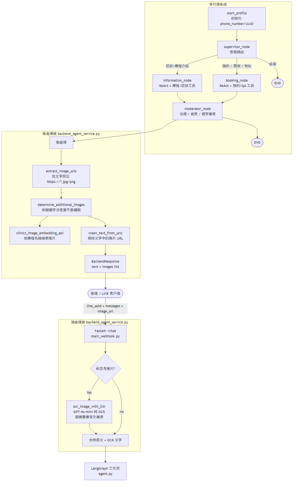

# 醫美診所 FB AI 客服 — 系統架構說明

本文件描述 `fb_clinics_agent` 專案的整體架構：從後端串接 (`/chat` API) 進入請求，經過 OCR 圖片預處理、LangGraph 多代理協作 (Supervisor → Information / Booking → Moderator)，到最後以「文字 + 圖片清單 + CallCS 標記」回傳的完整流程。

---

## 1. 高層流程概觀

```
[後端 / FB Messenger 整合層]
        │  POST /chat
        │  (fb_account + content/image_url + message_history + ad_referral + treatment_fees)
        ▼
┌──────────────────────────────────────────────┐
│  main_webhook.py  (FastAPI, root_path=       │
│   "/fb-clinics-agent")                       │
│  └─ /chat → backend_agent_service.execute_…  │
└──────────────────────────────────────────────┘
        │
        ▼
┌──────────────────────────────────────────────┐
│  backend_agent_service.py                    │
│   1. 反轉 message_history → LangChain msgs   │
│   2. OCR 圖片 (GPT-4o-mini, 無醫療 prompt)   │
│   3. 純圖無文字 → 短路回「請問哪個部位」     │
│   4. 兩階段 pre-filter treatment_fees        │
│   5. 注入 fee + ad_referral SystemMessage     │
│   6. 餵入 DoctorAppointmentAgent.workflow()  │
│   7. 從回覆抽圖 URL + 動態補圖 + 去重        │
│   8. 判定 CallCS (0/1/2) + 清空對應欄位      │
│   9. 清理文字 → BackendResponse              │
└──────────────────────────────────────────────┘
        │
        ▼
┌──────────────────────────────────────────────┐
│  agent.py  (LangGraph)                       │
│   start_profilo → supervisor                 │
│        ├─► information_node ─► moderator ─► END
│        ├─► booking_node     ─► moderator ─► END
│        └─► FINISH                            │
│   * Stateless: 不使用 checkpointer，          │
│     歷史由後端隨 request 傳入                 │
└──────────────────────────────────────────────┘
```

---

## 2. 系統架構圖 (Mermaid)



---

## 3. 對外 API 介面 (`main_webhook.py`)

| Method | Path | 說明 |
| --- | --- | --- |
| POST | /chat | 後端工程師串接用的主要端點，回傳 text + images + CallCS |

對外完整 URL（經 Nginx 反向代理）：

| 項目 | 值 |
|---|---|
| Production | `POST https://ai.gastom.com.tw/fb-clinics-agent/chat` |
| Swagger UI | `https://ai.gastom.com.tw/fb-clinics-agent/docs` |
| OpenAPI JSON | `https://ai.gastom.com.tw/fb-clinics-agent/openapi.json` |

FastAPI 透過 `root_path="/fb-clinics-agent"` 告訴自己處於前綴底下，確保 Swagger UI 抓 openapi.json 走對的 URL。

### Request (`BackendUserQuery` — `app/models.py`)
```json
{
  "fb_account": "1234567890abcdef",
  "content": "我想了解 NEO 療程",
  "image_url": [],
  "message_history": [
    {"type": "ai",    "content": "您好！我是霍普艾小編"},
    {"type": "human", "content": "你好"}
  ],
  "ad_referral": null,
  "treatment_fees": [
    {"name": "NEO-熱磁減脂(30分鐘) + 冷凍單點(60分鐘)", "price": 15999}
  ]
}
```

### 欄位說明

| 欄位 | 型別 | 用途 |
|---|---|---|
| `fb_account` | str | Messenger PSID，識別客人 |
| `content` | str/null | 客人此輪傳的文字（圖片訊息時為 null）|
| `image_url` | List[str] | 客人此輪傳的圖片陣列（可多張；文字訊息時為空 list）|
| `message_history` | List[HistoryMessage] | 過去對話，由新到舊（service 內部會 reverse 還原時序）|
| `ad_referral` | str/null | 客人從 Meta 廣告進來的療程關鍵字，只在首次對話時帶 |
| `treatment_fees` | List[TreatmentFee] | 目前各療程體驗價（後端從 DB / Sheets 即時抓送進來）|

### Response (`BackendResponse`)
```json
{
  "text": "NEO 是一款熱磁減脂療程...",
  "images": ["https://hopkins-main.s3.../neo_intro.jpg"],
  "CallCS": 0
}
```

| CallCS | 意義 | text / images 內容 | 後端動作 |
|---|---|---|---|
| 0 | 一般對話 | AI 回覆 + 相關圖片 | 推給客人 |
| 1 | 客人主動找真人客服 | 空字串 / 空 list | 不推 AI 內容，直接通知客服 |
| 2 | 預約流程 (set_appointment 觸發) | AI 預約引導文字 / 空 list | 先推 text 給客人，再通知客服 |

### Stateless 設計
本服務**不保留任何客人狀態**：
- 沒有 LangGraph checkpointer
- 沒有 session / cookie / DB
- 對話歷史完全由後端從 DB 撈出後隨 request 帶入
- 重啟 / horizontal scale 不會掉資料

---

## 4. 預處理層 — 圖片 OCR

實作於 `backend_agent_service.ocr_image_with_llm()`：

* 用獨立 `ChatOpenAI(model="gpt-4o-mini", temperature=0)` 實例。
* **刻意不掛醫美 system prompt**，prompt 只要求「輸出圖片中的所有文字」，目的是**避開 OpenAI 對醫療類圖片的 Safety Filter**。
* 圖片無文字時 LLM 回傳 sentinel `NO_TEXT_FOUND`，service 端會濾掉（同時也濾掉「空字串 / 無 / 沒有文字」等常見變體，防止 LLM 字面解讀 prompt）。
* OCR 結果若有抓到文字，會以 `\n\n[客人上傳的圖片內容：]\n{...}` 形式附加在使用者原文後面，再丟進主 Agent。

### 短路機制
若客人**只傳圖、文字 OCR 抓不到任何內容**（純臉照 / 純物件照），**不跑 LLM** 直接回傳：

```json
{
  "text": "請問您是想諮詢哪個部位呢？",
  "images": [],
  "CallCS": 0
}
```

省 token 又避開 OpenAI 對人臉照的 safety filter。

---

## 5. 多代理工作流 (`agent.py`)

### 5.1 State 結構 (`AgentState`)
```python
class AgentState(TypedDict):
    messages: Annotated[list[Any], add_messages]
    fb_account: str
    next: str
    query: str
    current_reasoning: str
    booking_completed: bool       # booking_node 偵測到 set_appointment 被呼叫時設 True
    should_terminate: bool
```

### 5.2 節點清單

| 節點 | 角色 |
| --- | --- |
| `start_profilo` | 初始化節點：注入 `fb_account`，導向 supervisor |
| `supervisor_node` | 「醫美診所經理」，用 `with_structured_output(Router)` 決定下一步 |
| `information_node` | ReAct agent，處理症狀理解、同理回應與療程介紹 |
| `booking_node` | ReAct agent，處理預約、體驗價、初診費、診所資訊；偵測 set_appointment 觸發後寫 `booking_completed=True` 給 backend 判定 CallCS=2 |
| `moderator_node` | 法規 / 語氣 / 錯字審查，最後一道把關 |

### 5.3 Graph 連線
```
START → start_profilo → supervisor
                        ├─► information_node → moderator_node → END
                        ├─► booking_node     → moderator_node → END
                        └─► FINISH (AIMessage: 「感謝您的諮詢…」) → END
```

### 5.4 持久化
**無**。Graph 用 `self.graph.compile()` 不帶 checkpointer。

---

## 6. Supervisor 路由規則

`supervisor_node` 用一段中文 system prompt + `with_structured_output(Router)` 強制輸出：
```python
class Router(TypedDict):
    next: Literal["information_node", "booking_node", "FINISH"]
    reasoning: str
```

判斷原則摘要：

| 條件 | 路由 |
| --- | --- |
| 描述症狀 / 詢問療程原理 / 改善方向（皮膚、體態、私密、睡眠神經）| `information_node` |
| 包含「費用 / 價錢 / 多少 / 初診 / 地址 / 電話 / 預約 / 改期 / 取消 / 時間」| `booking_node` |
| **包含「活動 / 優惠 / 促銷 / 檔期 / 方案 / 套裝 / 打折」**（醫美脈絡下 = 費用範疇）| `booking_node` |
| 「謝謝 / 沒事 / 沒問題了」等結束語 | `FINISH` |
| 與醫美無關（政治、法律、技術等）| 禮貌拒絕並導回醫美 |

---

## 7. Information Node

- 模式：`create_react_agent` (Thought → Action → Observation 循環，但**不輸出**過程)。
- 工具：
  - `get_empathy_questions_by_symptom(symptom_tag)`：以**標準標籤**（皺紋類 / 私密療程 / 睡眠與神經 / 體態管理 / 皮膚其他）查內建字典，回傳同理話 + 1 個追問。
  - `search_clinics_by_keyword(symptom)`：呼叫 `ensemble_retriever` 從 `data/clinics_introductions3.csv` 找療程介紹。
- 關鍵 Prompt 規則：
  - 一回合最多呼叫一個工具。
  - 症狀必須先**歸一化**為標準標籤，再傳給同理工具。
  - 嚴禁循環追問；客人若已給 ≥2 個關鍵字就直接給專業建議。
  - 不可主動誇大療效；提到療程時用「可以幫助改善 / 有些人會選擇」這類保守語氣。
  - 想出對比照時，需用固定格式：`「這是[療程名稱]的對比照: <https URL>」`，下游才能正確抽圖。

---

## 8. Booking Node

- 模式：`create_react_agent`。
- 工具：
  - `set_appointment(symptom)`：回傳一段制式預約資訊收集表單（姓名 / 療程 / 時間 / 特殊需求 / 電話），並把 `should_terminate=True`。**呼叫此 tool 後 booking_node 會寫 `booking_completed=True` 到 state**，backend 端據此設 CallCS=2。
  - `search_clinics_info(treatment_name, category="初診" / "地址" / "電話" ...)`：依 `category` 三路分流（見 §8 費用查詢分流、§16.1/16.3）：
    1. 含「初診/諮詢」→ `get_consult_info` 查 `data/consult_plan.csv`（結構化，免費/收費看 `consult_free` 欄）。
    2. 命中 `CLINIC_INFO_INTENT`（地址/交通/電話/看診/停車…）→ 直接回 `CLINIC_BASIC_INFO`（`clinics_qa.csv` 的「診所地點」那筆），不經模糊檢索。
    3. 其餘 → 用 `category` 做 boosted query 走 `qa_retriever`（`treatment_name` 只在第 1 路用到）。
- 關鍵 Prompt 規則：

### 費用查詢有兩種，需嚴格分流

| 客人問 | 路徑 | 來源 |
|---|---|---|
| **初診費 / 諮詢檢測費 / 第一次來多少** | 呼叫 `search_clinics_info(name, "初診")` → `get_consult_info` 結構化查表 | `data/consult_plan.csv`（免費/收費由 `consult_free` 欄決定，不用語意檢索） |
| **療程體驗價 / {療程}多少錢 / 單次費用** | 從 SystemMessage `[費用資訊]` 找對應 name + `price` | `treatment_fees` (request payload) |

> ⚠️ 免費與否一律由 `consult_plan.csv` 的 `consult_free` 欄決定，**提示詞不再主動寫「免費」**（見 §16.1）。

### 報體驗價時必須同時呼叫 search_clinics_info("X","初診")
讓 AI 把「體驗價 + 初診評估說明」整合回客人，例如：

> 「NEO 熱磁減脂搭配冷凍的組合有兩種方案：搭配單點 NT$ 15,999、搭配雙點 NT$ 18,999。
> 療程前我們會先為您安排諮詢檢測評估，會檢測皮下脂肪、內臟脂肪、肌肉量、基礎代謝率等指數...」

### 防幻覺：費用 Pre-filter (`backend_agent_service.find_relevant_fees`)
1. **Stage 1**: 從當前 `content` 抓 TREATMENT_KEYWORDS（NEO, Emface, SIS, EMBODY, 冷凍 ...）
2. **Stage 2**: 沒命中就用小 LLM (`identify_treatments_from_context`) 看歷史對話判斷代名詞（「這個」「那個」）與**序數（「第一個」「第二個」「前者」）**——由新往回找最近一則列出療程/編號的 AI 訊息再對照（見 §16.2）
3. **Stage 3**: 還是沒命中 → fallback 整份費用表

只把命中的療程行注入 SystemMessage，AI 物理上看不到無關行 → 不會張冠李戴。

### set_appointment 規則
- 客人**首次表達預約意願**才呼叫一次
- 客人填完表單 / 確認後**不要再呼叫**（否則 tool 會回傳同樣的表單模板造成 AI 困惑）

---

## 9. Moderator Node — 出口審查

每次 `information_node` 或 `booking_node` 的回覆都會經過 `moderator_node`：

1. **錯字修正**：例如 `NEOT → NEO`；但**嚴禁**把「猛健樂 / 瘦瘦筆 / 週纖達」自動改成 `EMBODY`。
2. **法規 / 語氣**：移除誇大、保證性字眼（「即時效果」「一定會好」「完全消除」「治癒」）。
3. **語言一致性**：強制繁體中文，僅特定療程名（NEO, EMBODY）保留英文，其他 fat/muscle 等翻成中文。
4. 直接回傳純文字給使用者，不能加任何「這是修改後版本」之類的前言。

---

## 10. 後處理 — 動態圖片決策、去重與 CallCS 判定

回覆從 LangGraph 出來後，`backend_agent_service.execute_backend_agent` 會做：

### 10.1 圖片決策 (`determine_additional_images`)
1. `extract_image_urls(text)` — 用 regex 撈出 `https://*.{jpg,jpeg,png,webp}`。
2. 依以下優先順序補圖：

   | 條件 | 補的圖 |
   | --- | --- |
   | 回覆包含「兩種方案」或「自律神經檢測」 | `treatment_procedure.jpg` + `autonomic_fees.jpg` |
   | 回覆談「地址 / 地點 / 位於」或使用者問「哪裡 / 停車 / 開車」 | `parking_lots.jpg` |
   | 否則：偵測 `Emface / NEO / SIS / 瘦瘦筆 / 週纖達 / EMBODY / 體態檢測 / 冷凍 / 冷脈衝` | 呼叫 `clinics_image_embedding_api` (score ≥ 0.7) 取對應療程圖 |

   特殊規則：
   - `冷凍 → 冷脈衝`、`瘦瘦筆 → 週纖達` 在搜圖前先正規化。
   - **Emface 過濾**：若回覆已含圖 URL 或提到「電波」，跳過補圖。
   - **互斥療程清單** (`NEO / SIS / 週纖達 / EMBODY / 冷脈衝`)：同一回覆出現 2 個以上時，全都不補介紹圖（避免一次塞太多療程圖）。

### 10.2 圖片去重
從 `message_history` 中所有 `type=="ai"` 的訊息抓出已發過的圖 URL，本輪要送的 `images` 過濾掉這些 URL → **同一張圖在歷史窗口內不會反覆發送**。

### 10.3 CallCS 判定
依優先順序：

1. **`sanitize_force_handoff`**（療程幻覺改寫失敗）→ `CallCS=1`
2. **CS_KEYWORDS 命中** (`user_query` 含「真人客服 / 轉專人 / 投訴 / 退費」等；片語見 §16.4) → `CallCS=1`，text/images 清空（最高優先，先於 booking 判定）
3. **`booking_completed=True`** (booking_node 偵測到 set_appointment 被呼叫) → `CallCS=2`，保留 text、images 清空
4. **以上都沒** → `CallCS=0`

### 10.4 文字後處理
1. `clean_text_from_urls(text, urls)` — 移除正文中的圖片引用，四步：①markdown 圖片語法 ``/``/`![alt]` ②裸 URL ③只剩 `<圖片網址N>:`/條列/標點的殘骸行 ④收多餘空行（見 §16.5）。
2. **停車補丁**：當最終 images 含 `parking_lots.jpg` 但正文沒提到「春光公園」，會強制覆蓋為固定的停車說明。

---

## 11. Retrievers

兩支 Retriever 都是 **Vector + BM25 的 EnsembleRetriever**，共用 `utils/shared_resources.py` 的 embedding model 與中文 jieba tokenizer。

### 11.1 `ensemble_retriever` — 療程介紹（給 information_node）
- 來源：`data/clinics_introductions3.csv`（big5）。
- 兩份文件視角：
  - vector：原文。
  - keyword：把 `suitable_for` 重複 3 次以加強 BM25 對「適合對象」的命中。
- 持久化：Chroma → `./chroma_token_split`，BM25 → `./bm25.pkl`。
- 權重：`vector 0.3 / keyword 0.7`，k = 5 (vector) / 3 (BM25)。

### 11.2 `qa_retriever` — 診所 QA（給 booking_node）
- 來源：`data/clinics_qa.csv`（utf-8-sig）。
- keyword 文件把 `keywords` 欄重複 3 次。
- 持久化：Chroma → `./chroma_qa`，BM25 → `./bm25_qa.pkl`。
- 權重：`vector 0.7 / keyword 0.3`，k = 2 / 2。（待辦：短關鍵字查詢偏 BM25 較準，可考慮翻成 `0.3 / 0.7` 並補強各 row keywords，見 §16.3。）
- 工具呼叫端 `search_clinics_info` 的 query boosting 已改為 **`"{category} {category} {category}"`**（不再灌療程名）；且**初診/諮詢**與**地址/交通等診所資訊**會在進入 retriever 前先被結構化查表攔截（見 §16.1、§16.3），實際走到 `qa_retriever` 的多為其餘長尾 FAQ。

---

## 12. 模型與外部依賴

| 用途 | 模型 / 服務 |
| --- | --- |
| 主 LLM (`utils/llms.py`) | `ChatOpenAI("gpt-4o-mini")` |
| OCR | `ChatOpenAI("gpt-4o-mini", temperature=0)` 獨立實例 |
| 代名詞解析 (find_relevant_fees Stage 2) | `ChatOpenAI("gpt-4o-mini", temperature=0)` 獨立實例 |
| Embedding | `utils/shared_resources.embedding_model` |
| 圖片檢索 API | `https://ai.gastom.com.tw/clinics_image_embedding_api/api/search` (POST) |
| 對話持久化 | **無**（由後端 AWS DB 負責，每次 request 傳 message_history 進來）|

---

## 13. 重要目錄結構

```
fb_clinics_agent/
├── Dockerfile                    # Multi-stage build (poetry install)
├── docker-compose.yml            # 本地起服務用
├── .dockerignore
├── main_webhook.py               # FastAPI entrypoint (/chat, root_path="/fb-clinics-agent")
├── agent.py                      # LangGraph 多代理 (Supervisor / Info / Booking / Moderator)
├── app/
│   ├── backend_agent_service.py  # OCR + pre-filter + 動態圖片 + CallCS 判定
│   └── models.py                 # BackendUserQuery / HistoryMessage / TreatmentFee / BackendResponse
├── toolkit/
│   └── toolkits.py               # set_appointment / search_clinics_by_keyword / search_clinics_info / get_empathy_questions_by_symptom
├── utils/
│   ├── llms.py                   # LLMModel (gpt-4o-mini)
│   ├── ensemble_retriever.py     # 療程介紹 (vector+BM25)
│   ├── qa_retriever.py           # 診所 QA (vector+BM25)
│   ├── consult_plan.py           # 初診/諮詢費結構化查表 (get_consult_info)
│   └── shared_resources.py       # embedding model + 中文 tokenizer
├── prompt_library/prompt.py      # 早期 supervisor system prompt (現已內嵌於 agent.py)
├── data/
│   ├── clinics_introductions3.csv
│   ├── clinics_qa.csv
│   └── consult_plan.csv          # 各療程初診費 (treatment/consult_free/consult_fee/plans)
├── chroma_token_split/           # 療程介紹 vector store (runtime 用 CSV 重建，不進 image)
├── chroma_qa/                    # QA vector store (runtime 用 CSV 重建，不進 image)
└── bm25.pkl / bm25_qa.pkl        # BM25 retriever 快取 (runtime 自動產生)
```

---

## 14. 一次完整請求的時序

```
Backend ─► POST /chat (fb_account, content/image_url, message_history, ad_referral, treatment_fees)
        │
        ▼
backend_agent_service.execute_backend_agent
  1. for each msg in message_history (reversed):  轉成 LangChain HumanMessage/AIMessage
  2. for each url in image_url:  ocr_image_with_llm()  (gpt-4o-mini, no medical prompt)
     → 過濾 NO_TEXT_FOUND / "空字串" 等假文字
  3. 純圖無文字 → 短路回「請問哪個部位」（不跑 LLM）
  4. find_relevant_fees() → 過濾出本次相關的 treatment_fees
  5. 注入 fee_note + (首次對話有 ad_referral 時) referral_note SystemMessage
  6. agent.workflow().invoke(query_data, config={recursion_limit: 20})  # 無 thread_id
        │
        ▼
    LangGraph
      start_profilo → supervisor
        Router(next, reasoning)
          ├─ information_node  (ReAct: empathy / search_clinics_by_keyword)
          ├─ booking_node      (ReAct: set_appointment / search_clinics_info)
          │   └─ 若呼叫 set_appointment → state["booking_completed"]=True
          └─ FINISH (固定收尾語)
        → moderator_node (法規 + 錯字 + 中文化)
        → END
        │
        ▼
  7. extract_image_urls(text)
  8. determine_additional_images(...)  → 視內容呼叫 image embedding API
  9. 圖片 dedup：從 message_history 撈出已發過的 URL，本輪過濾
  10. CallCS 判定 (sanitize 改寫失敗 → 1 / CS_KEYWORDS → 1 / booking_completed → 2 / else → 0)
      - CallCS=1：text/images 清空
      - CallCS=2：images 清空，保留 text
  11. clean_text_from_urls(...)  → 去 markdown 圖片語法 + 裸 URL + 標籤殘骸行
  12. 停車場資訊強制補字
        │
        ▼
BackendResponse(text, images, CallCS) ─► Backend
                                          ├─ CallCS=0：推給客人
                                          ├─ CallCS=1：不推 AI 內容，通知客服
                                          └─ CallCS=2：先推 text，再通知客服
```

---

## 15. 設計上的幾個關鍵決定

1. **Stateless AI service**：所有對話狀態由後端 AWS DB 管理，AI service 重啟不掉資料、可水平擴展。
2. **OCR 與主 Agent 解耦**：避開 OpenAI 對醫療影像的 Safety Filter，OCR 用無領域 prompt 的乾淨模型實例。
3. **意圖路由用 structured output**：`Router` TypedDict 強制 LLM 只能回 `information_node / booking_node / FINISH`，不會出現自由發揮。
4. **Moderator 作為最後一道閘**：所有對外文字都經過合規 / 語氣審查，把醫療法規風險集中處理在單點。
5. **體驗價走 SystemMessage、初診費走結構化查表**：費用本質上是兩種來源（動態 `treatment_fees` vs 靜態 `consult_plan.csv`），分流防止 AI 混淆；初診費的免費/收費由 `consult_free` 欄明確決定，不再靠語意檢索推論（見 §16.1）。
11. **固定事實不賭模糊檢索**：診所地址/交通/電話/看診時間/停車（全在一筆）改為意圖命中即直接回傳，初診費改為結構化查表——短查詢用向量/BM25 排名不穩，固定事實一律走確定性查表（見 §16.3）。
6. **費用 Pre-filter 防幻覺**：兩階段過濾（keyword + LLM 代名詞解析）讓 AI 物理上看不到無關費用行。
7. **圖片不交給 LLM 自由生成**：療程圖以「關鍵字判斷 + 對外 embedding API」決定，避免 LLM 幻覺出不存在的 URL；對比照才允許在 prompt 裡用固定格式內嵌。
8. **圖片去重靠 history**：從 message_history 反推已發過的 URL，避免 AI 反覆推同一張圖騷擾客人。
9. **Vector + BM25 雙路檢索**：療程介紹偏 BM25（命中具體療程名 / 適合對象），QA 偏 vector（語意相近的問法），權重分別調校。
10. **CallCS 三值設計**：把「客人主動找真人 (1)」跟「AI 觸發預約流程 (2)」分開，後端可以對兩種情境採取不同的客戶體驗（前者立刻轉接、後者先讓客人看到表單再轉接）。

---

## 16. 變更記錄 (2026-06-10)

本次調整聚焦三類問題：**初診費「免費」誤判**、**診所資訊／療程指代檢索不準**、**圖片殘骸與轉真人漏接**，並修掉部署時的快取 stale 問題。

### 16.1 初診 / 諮詢費 → 結構化查表（取代語意檢索）
- 新增 `data/consult_plan.csv`（`treatment, consult_free, consult_fee, plans`，一療程一列，免費/收費是明確欄位）。
- 新增 `utils/consult_plan.py`：`get_consult_info(treatment_name, synonyms)` 以療程名查表（同義詞群組優先、子字串次之），同義詞表由呼叫端傳入避免循環 import。
- `search_clinics_info`：`category` 含「初診/諮詢」時先查 consult_plan，查到直接回、查不到才 fallback `qa_retriever`。
- 從 `clinics_qa.csv` 移除各療程初診費 row（單一來源）；移除提示詞/模板主動寫「免費」，免費與否一律由 `consult_free` 決定。

### 16.2 療程指代（序數/代名詞）檢索修正
- `identify_treatments_from_context` prompt 新增「序數（第一個/第二個/前者/後者）」處理：由新往回找「最近一則列出療程/編號的 AI 訊息」再對照；並把「相關療程」收緊為「實際指向的療程」。

### 16.3 診所基本資訊（地址/交通/電話/看診時間/停車）→ 確定性查表
- `search_clinics_info` 的 `treatment_name` 改為**只用於 `get_consult_info`**；retriever 路徑改用 `category` 查（不再被占位字「診所」灌爆）。
- 新增 `CLINIC_BASIC_INFO`（載入時抓 `clinics_qa.csv` 中 `question==診所地點` 或 `category==交通` 那筆）與 `CLINIC_INFO_INTENT`（地址/交通/怎麼去/停車/電話/看診…）。
- `category` 命中意圖 → 直接回 `CLINIC_BASIC_INFO`，不賭模糊排名；缺資料才 fallback。加 `[qa]` 檢索觀測 log。
- 待辦：`qa_retriever` 權重可由 `[0.7,0.3]→[0.3,0.7]`（偏 BM25）＋ 補強各 row keywords，提升長尾 FAQ 命中。

### 16.4 轉真人客服（CallCS=1）漏接修正
- `CS_KEYWORDS` 補片語（不含單獨「真人」以免誤判「真人案例」）：`專人`、`轉接`、`轉人工`、`真人服務`、`要真人`。修正「轉專人」被誤判成 CallCS=2 的問題。

### 16.5 圖片殘骸清理（`clean_text_from_urls`）
- 改為四步：①拔 markdown 圖片語法 ``/``/`![alt]` ②拔裸 URL ③逐行清掉只剩 `<圖片網址N>:`/條列/標點的殘骸行 ④收多餘空行。處理「URL 被抽走後留下空標籤/空 ``」的三種格式。

### 16.6 部署：不再把快取烤進 image（修 stale）
- `Dockerfile` 移除 `COPY chroma_*`；CMD 先單進程 warmup（`python -c 'import toolkit.toolkits'`）建索引，再起 `uvicorn --workers 2`（避免兩 worker 同時重建 chroma 衝突）。
- `.dockerignore` 新增排除 `chroma_qa/`、`chroma_token_split/`（原已排除 `*.pkl`）。
- 部署：上傳 → `docker compose build --no-cache` → 用新 image 重新部署（勿只 restart 舊容器）。

### 16.7 驗證清單
| 測試輸入 | 預期 |
|---|---|
| 你們交通? / 地址? / 怎麼去? | 回地址＋捷運＋看診時間（`[clinic_info]` 命中） |
| 腦波機初診多少? | $4,800 / $1,000（consult_plan，收費） |
| Emface 諮詢要錢嗎? | 免費（consult_plan） |
| 第一個也有體驗方案嗎?（承上文編號清單） | 對應到清單第 1 項療程 |
| 我想轉專人 | CallCS=1（清空 text/images） |
| 問對比圖 | 文字無空標籤/空 ``，圖以獨立訊息送出 |
